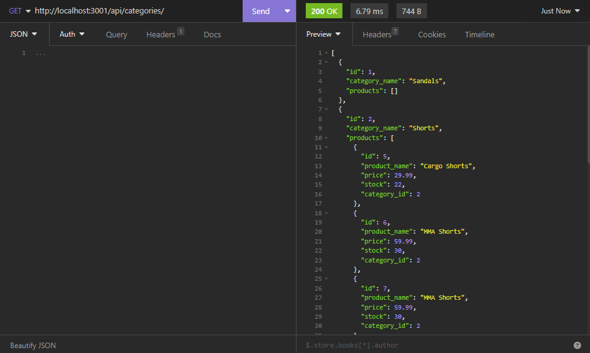

# 13-E-Commerce-BackEnd by Carlos Osuna


## Description:📚
```
This is a backend project in which various HTTP request methods are demonstrated through INSOMNIA API. The methods included are post, get, put and delete. These are demonstrated with the E-Commerce company on Products, Categories, Tags and ProductTags.

The user will be able to retrieve information from these fields/tables with a GET request, create a new object wit POST, update an already existant object wit PUT and delete an object with DELETE.
```


## User Story:👩‍💻
```
AS A manager at an internet retail company
I WANT a back end for my e-commerce website that uses the latest technologies
SO THAT my company can compete with other e-commerce companies
```

## Acceptance Criteria:🗃️
```
GIVEN a functional Express.js API
WHEN I add my database name, MySQL username, and MySQL password to an environment variable file
THEN I am able to connect to a database using Sequelize
WHEN I enter schema and seed commands
THEN a development database is created and is seeded with test data
WHEN I enter the command to invoke the application
THEN my server is started and the Sequelize models are synced to the MySQL database
WHEN I open API GET routes in Insomnia Core for categories, products, or tags
THEN the data for each of these routes is displayed in a formatted JSON
WHEN I test API POST, PUT, and DELETE routes in Insomnia Core
THEN I am able to successfully create, update, and delete data in my database
```

## Screenshots:📸




## All tech/dependencies used:🧪
- dotenv
- express
- mysql2
- sequelize
- Insomnia REST API App

## Links:📨
[GitHub Repo](https://github.com/OkamiXX/13-E-Commerce-BackEnd)

[Walkthrough Video]()
